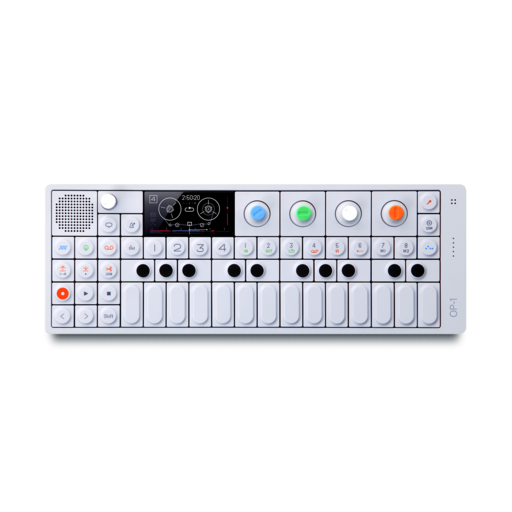
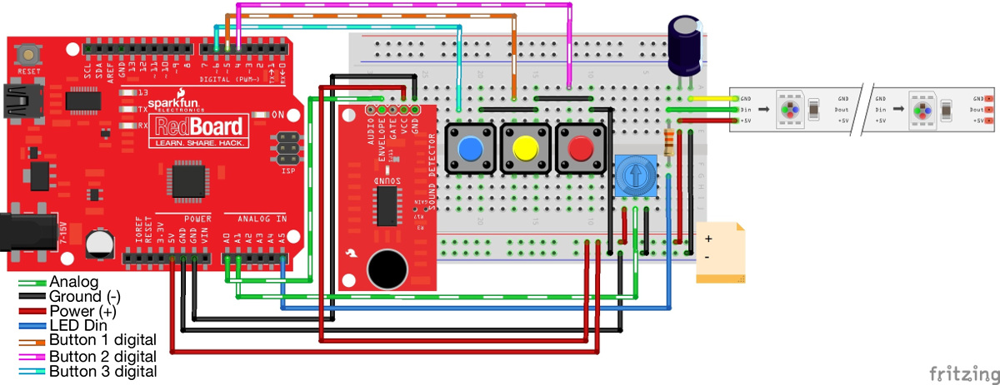

# Music Reactive LEDs
UC Application: Creativity, Fall 2019

[Inspiration](https://learn.sparkfun.com/tutorials/interactive-led-music-visualizer/all)

## Background
"Every person has a creative side, and it can be expressed in many ways: problem solving, original and innovative thinking, and artistically, to name a few. Describe how you express your creative side."

I chose to answer this personal insight question for my UC application because music is my passion. 

I hated choir in 4th grade. I thought choir songs were uninspiring until we sang *The Beatles - Yesterday*. I fell in love with singing ever since. 

I was a part of the school choir for the rest of elementary, middle, and high school. I became the Bass Section Leader and sang in the Mixed, Concert, and Chamber Choir in high school and performed countless concerts, including two operas. I also took part in my high school's theatre program taking on leadership roles as Music Director and Light Director. 

I wanted to create LED lights that would react to the music, combining my love for music and engineering. I worked on this project throughout November 2019.

## Music & OP-1
The OP-1 is a synthesizer, sampler, and sequencer capable of playing 4 tracks concurrently.

The song I chose to reverse engineer was *Kanye West - Paranoid*.

The first track consisted of the main melodic line of the song. I practiced it by ear and figured out how to record and play it on the OP-1's keyboard.

The second track consisted of the rhythmic chords that drives the verse and chorus. I watched a YouTube cover of someone playing the song and copied the chords. 

The third track consisted of the constant bass line. Simple but absolutely necessary.
 
The fourth track consisted of the drums. This is definitely the most difficult part to figure out. I needed to layer the bass drums, the snares, and the hi hats all in one track.

Throughout the recording process, I manipulated each component of the song to sound as similar to the original song as much as possible. 

## Engineering & Arduino

While doing this project, I learned about "sequenced averages" and how it was used to adjust the average of the volume so we get a much better response as compared to using "true averages". A great explanation can be found [here](https://github.com/mbartlet/SparkFun-RGB-LED-Music-Sound-Visualizer-Arduino-Code/blob/master/code%20math.md)

Although none of this was my original work, I still learned so much from figuring out the circuit and the code. I learned about signal processing and sampling and Fast Fourier Transformation. I learned how people are able to implement mathematical models into code that the Arduino can process and direct the LED lights. 

Most importantly, I learned that there is so much for me to learn and that excites me.

